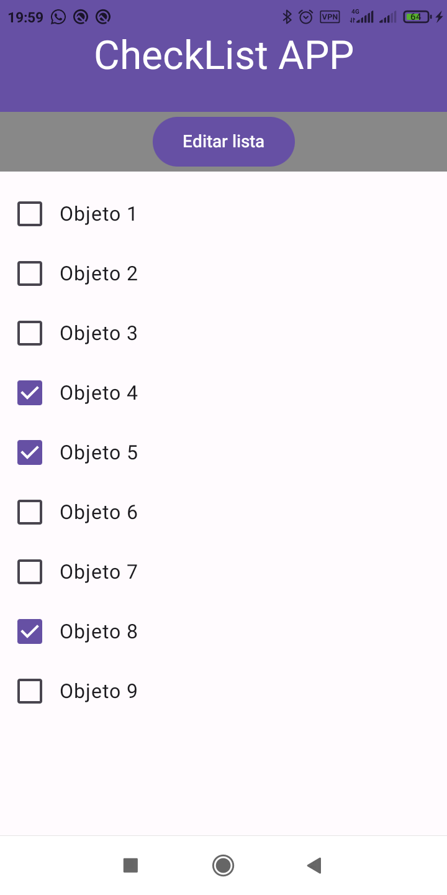
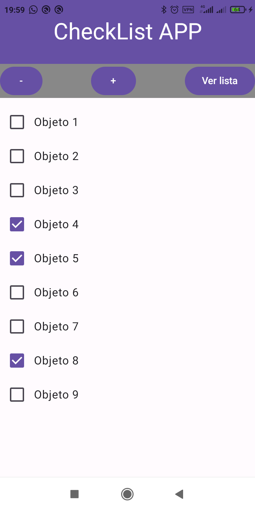

# CheckList App
La CheckList App es una aplicación simple de listas de verificación desarrollada con Jetpack Compose en Android. Permite crear y gestionar listas con elementos que pueden ser marcados como completados. El usuario puede agregar, eliminar o visualizar los elementos de la lista de forma dinámica.

## Funcionalidades
### Editor de Lista: 
El usuario puede agregar nuevos elementos a la lista y eliminarlos.
### Vista de Lista: 
El usuario puede ver todos los elementos de la lista y sus estados (marcados o no).

##Interacción con Checkboxes: 
Cada elemento de la lista tiene un checkbox que puede marcarse o desmarcarse.

## Navegación entre pantallas: 
La aplicación permite navegar entre dos pantallas:

### Editor: 
Para agregar y eliminar elementos.

### Vista: 
Para visualizar los elementos de la lista con su estado.

## Estructura de la Aplicación
### MainActivity: 
La actividad principal que contiene el scaffolding y las pantallas principales.

### Navegación: 
Uso de NavController para manejar la navegación entre las pantallas.

### Pantalla de Edición (CheckListEditor): 
Permite agregar y eliminar elementos de la lista.

### Pantalla de Visualización (CheckListViewer): 
Muestra la lista de elementos con la opción de ver el estado de cada uno.